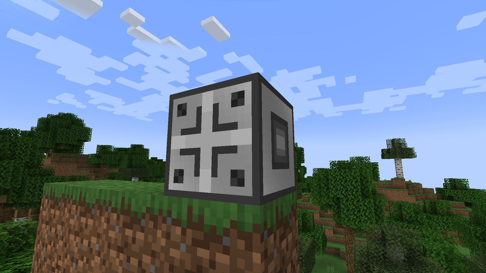
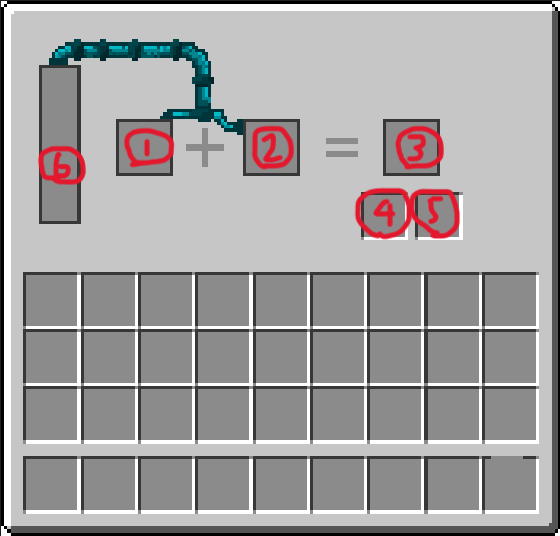
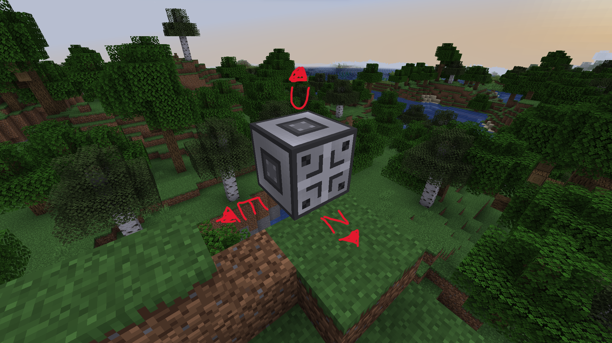
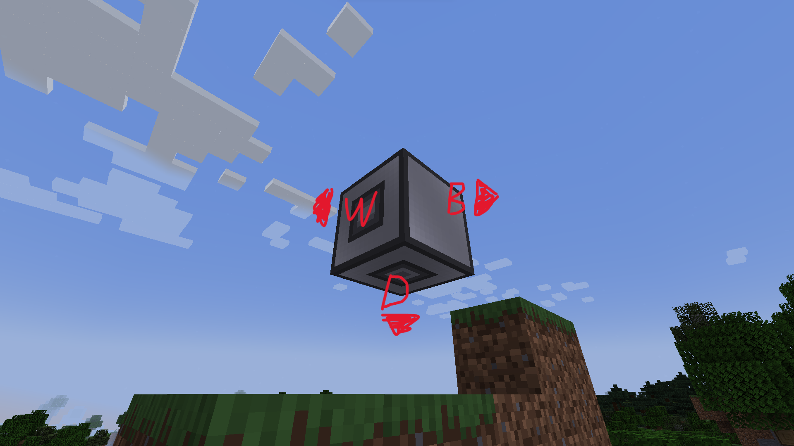

# Adder
## Appearance

## GUI Interface

1. **(INPUT)** Left Input Slot
2. **(INPUT)** Right Input Slot
3. **(OUTPUT)** Main Output Slot
4. **(OUTPUT)** By-product 1 Output Slot
5. **(OUTPUT)** By-product 2 Output Slot
6. **(OUTPUT)** Fluid Output

## Side Inventory

#### North
- Fluid Output **EXTRACT**

#### East
- Left Input Slot **INSERT**
- Fluid Output **EXTRACT**

#### Up
- Right Input Slot **INSERT**
- Fluid Output **EXTRACT**

#### West
- Main Output Slot **EXTRACT**
- Fluid Output **EXTRACT**

#### Back
- Fluid Output **EXTRACT**

#### Down
- By-products Slot 1 and 2 **EXTRACT**
- Fluid Output **EXTRACT**