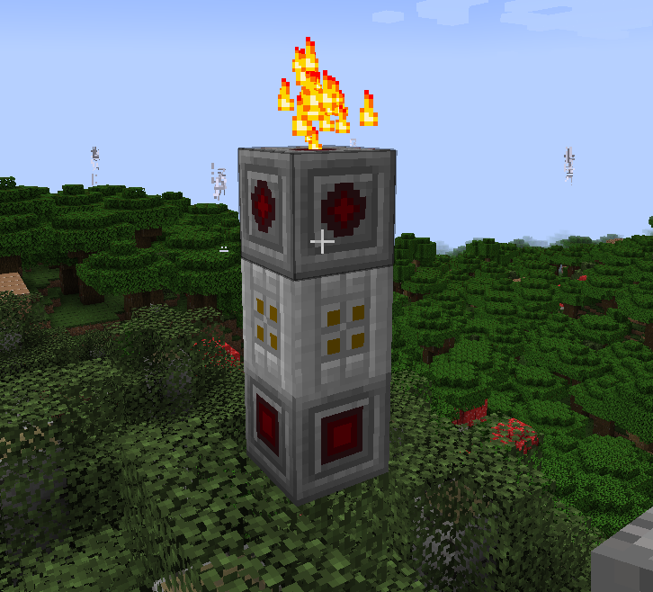

# Etching Machine
## Appearance

## Begineer Guide
1. Make a Etching Machine Controller, a Etching Machine Encoder, and a Etching Machine Decoder
2. Stack them up like the appearance shown above and the controller should be yellow.
3. The Encoder emits redstone randomly and the decoder reads the redstone signal. 
4. Right click the Controller and you will get a secret list of numbers 
5. In this case, it means that when encoder emitts a redstone power of 0, the decoder needs to receive power of 1, when encoder emitts 1, the decoder needs to receive power of 5, and so on.
- encoder(up) -> decoder(down)
- 0 -> 1
- 1 -> 5
- 2 -> 0
- 3 -> 15
- 4 -> 9
- 5 -> 11
- 6 -> 3
- 7 -> 7
- 8 -> 13
- 9 -> 8
- 10 -> 6
- 11 -> 2
- 12 -> 14
- 13 -> 4
- 14 -> 10
- 15 -> 12

your goal is to construct a redstone circuit that processes the signals emits by the encoder and send it back to the decoder.

6. After sending the right signal to the decoder, the controller will turn green and the machine will start to emit particles. 
7. drop some bedrock gravel by the machine and there is a $\frac{1}{720}$ per tick to turn into blocks of amethyst.
   